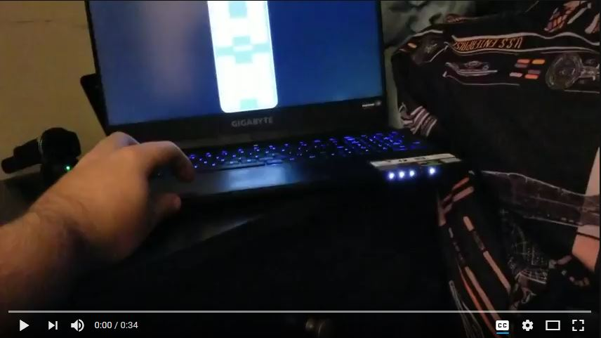

# BedREST

A nodejs based REST service for controlling a Reverie MotionSIGNATURE adjustable
bed foundation equipped with a Bluetooth LE controller.

This service is also reported to work with the Purple PowerBase which appears to
use the same controller as the MotionSIGNATURE.

## Requirements

You'll need a Bluetooth LE capable Bluetooth adapter and software stack. I used
a Raspberry Pi running Raspbian with a [usb-bt4le](https://plugable.com/products/usb-bt4le/) adapter
which seems to perform pretty well for me. The [noble](https://github.com/noble/noble)
project has more information about compatible operating systems and Bluetooth
adapters.

## Installation

Install a recent version of nodejs, clone this repository, and then form a
command prompt type:

    npm install

## Configuration

In order for BedREST to see your bed you'll have to give it the MAC address of
the bed(s) you want to connect to and give them friendly labels. You can do
this by editing bedrest.js and editing the following:

    this.beds = { "01:23:45:67:89:0A": "bed1", "01:23:45:67:89:0B": "bed2" };

This would tell BedREST to look for and connect to two different beds on startup.

## Running

To run the service just open a command prompt to the working directory and type:

    node bedrest.js

Please note that this service doesn't presently have any type of authentication
built in. Don't run this on a computer directly connected to the Internet unless
you want strangers controlling your bed.

### Making Requests

By default BedREST runs on port 8080 and listens for commands with this pattern:

    /bed/<label>/<command>/<value>

Where label is the name of a bed you assigned in bedrest.js and command is one
of the following:

| Command            | Needs Value | Range      | Description                                                                             |
|--------------------|-------------|------------|-----------------------------------------------------------------------------------------|
| headup             | No          | N/A        | Start elevating the head position.                                                      |
| headdown           | No          | N/A        | Start lowering the head position.                                                       |
| footup             | No          | N/A        | Start elevating the foot position.                                                      |
| footdown           | No          | N/A        | Start lowering the foot position.                                                       |
| stopmotion         | No          | N/A        | Stops head and foot motion.                                                             |
| headposition       | Yes         | 0 - 0x64   | Sets the absolute head position.                                                        |
| footposition       | Yes         | 0 - 0x64   | Sets the absolute foot position.                                                        |
| massageheadup      | No          | N/A        | Start increasing the head massage intensity.                                            |
| massageheaddown    | No          | N/A        | Start decreasing the head massage intensity.                                            |
| massagefootup      | No          | N/A        | Start increasing the foot massage intensity.                                            |
| massagefootdown    | No          | N/A        | Start decreasing the foot massage intensity.                                            |
| stopmassagemotion  | No          | N/A        | Stop head and foot massage immediately.                                                 |
| headmassage        | Yes         | 0 - 0x0A   | Set the absolute head massage intensity.                                                |
| footmassage        | Yes         | 0 - 0x0A   | Set the absolute foot massage intensity.                                                |
| fullbodymassage    | No          | 0x41 - 0x44| Start a full body massage.                                                              |
| flat               | No          | N/A        | Flatten the head and foot positions.                                                    |
| zerog              | No          | N/A        | Put the head and foot positions into "Zero G" mode.                                     |
| antisnore          | No          | N/A        | Put the head and foot positions into anti-snore mode.                                   |
| memrecall1         | No          | N/A        | Recalls memory position 1.                                                              |
| memrecall2         | No          | N/A        | Recalls memory position 2.                                                              |
| memrecall3         | No          | N/A        | Recalls memory position 3.                                                              |
| memrecall4         | No          | N/A        | Recalls memory position 4.                                                              |
| memsave1           | No          | N/A        | Saves current position to memory position 1.                                            |
| memsave2           | No          | N/A        | Saves current position to memory position 2.                                            |
| memsave3           | No          | N/A        | Saves current position to memory position 3.                                            |
| memsave4           | No          | N/A        | Saves current position to memory position 4.                                            |
| lighttoggle        | No          | N/A        | Toggles the under-bed night-light on and off.                                           |
| lightbrightness    | Yes         | 0 - 0x7C   | Adjusts the night-light brightness.                                                     |
| lighttimer         | Yes         | 0 - 0xFFFF | Sets the number of seconds until the light automatically turns off, 0 to disable timer. |
| status             | No          | N/A        | Gets the current position and massage status of the bed along with the version of the protocol and the last heartbeat time.

If the command you're trying to send requires a value it should be sent in hex,
without any leading 0x. For example sending decimal 100 (0x64 hex) to the
'mybed' bed and 'headposition' command would look like this:

    POST http://localhost:8080/bed/mybed/headposition/64

Commands that don't require a value should simply omit it, for example the
'flat' command:

    POST http://localhost:8080/bed/mybed/flat

There's an example web application located in the interface/ folder.

#### Streaming Updates

If you want to receive streaming updates for the position of the bed you can
connect to the server from a websocket connection like this:

    let ws = new WebSocket("ws://localhost:8080")
    ws.onmessage = (msg) => console.log(JSON.parse(msg.data))

When you adjust the position or the massage level of the bed you should start
to see updates in your console like this:

    {
        "bed": "alice",
        "address": "00:01:02:03:04:05",
        "status": {
            "headPos": 30,
            "footPos": 65,
            "headMassage": 0,
            "footMassage": 0,
            "unknown1": 0,
            "unknown2": 0,
            "checksum": 0
        }
    }

## Bluetooth LE Technical Details

The Bluetooth LE module for the Reverie MotionSIGNATURE bed advertises the
following service UUID:

    1b1d9641-b942-4da8-89cc-98e6a58fbd93

The bed then uses a custom 128-bit characteristic:

    6af87926-dc79-412e-a3e0-5f85c2d55de2

That characteristic is flagged to accept indicate and write requests. All of the
following commands are write requests.

### Command List

| Name                   | Command      | Arguments | Description                                                                             |
|------------------------|--------------|-----------|-----------------------------------------------------------------------------------------|
| Head Up                | 0x550154     | None      | Start elevating the head position.                                                      |
| Head Down              | 0x550356     | None      | Start lowering the head position.                                                       |
| Foot Up                | 0x550257     | None      | Start elevating the foot position.                                                      |
| Foot Down              | 0x550451     | None      | Start lowering the foot position.                                                       |
| Stop Motion            | 0x55FFAA     | None      | Stops head and foot motion.                                                             |
| Set Head Position      | 0x5551NNCC   | 0 - 0x64  | Sets the absolute head position.                                                        |
| Set Foot Position      | 0x5552NNCC   | 0 - 0x64  | Sets the absolute foot position.                                                        |
| Head Massage Up        | 0x553164     | None      | Start increasing the head massage intensity.                                            |
| Head Massage Down      | 0x553366     | None      | Start decreasing the head massage intensity.                                            |
| Foot Massage Up        | 0x553267     | None      | Start increasing the foot massage intensity.                                            |
| Foot Massage Down      | 0x553461     | None      | Start decreasing the foot massage intensity.                                            |
| Stop Massage Motion    | 0x550055     | None      | Stop increasing or decreasing foot or head massage intensity.                           |
| Stop Massage           | 0x553560     | None      | Stop head and foot massage immediately.                                                 |
| Set Head Massage Level | 0x5553NNCC   | 0 - 0x0A  | Set the absolute head massage intensity.                                                |
| Set Foot Massage Level | 0x5554NNCC   | 0 - 0x0A  | Set the absolute foot massage intensity.                                                |
| Full Body Massage      | 0x554NCC     | 1 - 4     | Start a full body massage, four different varieties (1-4).                              |
| Flat                   | 0x550550     | None      | Flatten the head and foot positions.                                                    |
| Zero G                 | 0x551540     | None      | Put the head and foot positions into "Zero G" mode.                                     |
| Anti-snore             | 0x551643     | None      | Put the head and foot positions into anti-snore mode.                                   |
| Mem Recall             | 0x551NCC     | 1 - 4     | Recalls memory position 1 - 4.                                                          |
| Mem Save               | 0x552NCC     | 1 - 4     | Saves current position in memory position 1-4.                                          |
| Light Toggle           | 0x555B       | None      | Toggles the under-bed night-light on and off.                                           |
| Light Brightness       | 0x555ANNCC   | 0 - 0x7C  | Adjusts the night-light brightness.                                                     |
| Light Timer            | 0x555FNNNN   | Seconds   | Sets the number of seconds until the light automatically turns off, 0 to disable timer. |

Note: CC in the above table is checksum. Checksum is calculated by xor-ing all of the preceeding command bytes together.

For instance take the "Set Head Position" command (say we're trying to set the value 10):

    55 51 0a 00

The checksum would be:

    0x55 ^ 0x51 ^ 0x0a = 0x0e

#### Reading the Current Status of the Bed

If you subscribe for notifications on the characteristic you should get one of
three message types:

| Name             | Pattern                      | Description |
|------------------|------------------------------|-------------|
| Protocol Version | 0x56:VV:VV:VV                | The version of the protocol, V's are an ASCII string (e.g. '1.0').
| Current Status   | 0x55:00:HH:FF:MH:MF:U1:U2:CC | Current status of the bed where:<ul><li>HH = Head Position</li><li>FF = Foot Position</li><li>MH = Massage Head Level</li><li>HF = Massage Foot Level</li><li>U1 = Unknown, varies per bed but doesn't seem to change otherwise.</li><li>U2 = Unknown, varies per bed but doesn't seem to change otherwise.</li><li>CC = XOR checksum of the previous bytes.</li></ul>
| Heartbeat        | 0x55:66:11                   | Unknown, but appears to be a heartbeat of some kind. Data doesn't appear to change.