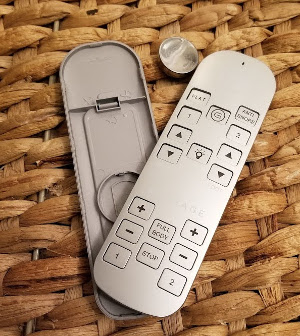
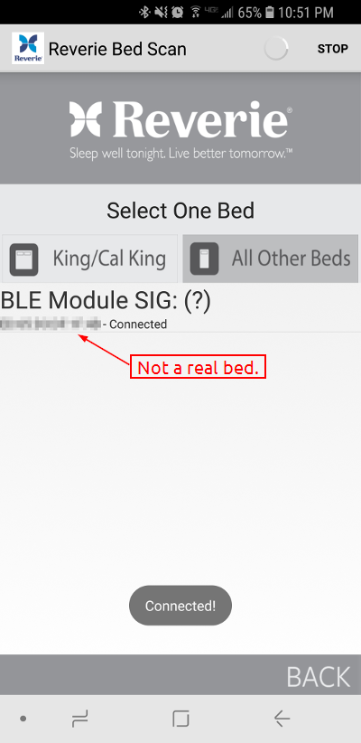

# Background

[BedREST](https://github.com/swedishborgie/bedrest) is a small nodejs based REST service
for controlling Reverie MotionSIGNATURE beds equipped with a Bluetooth LE module.

# Why?

My wife and I bought one of these beds a few years ago while looking for a new
bed. I don't have any complaints about the bed itself but after a couple years
and a nasty drop I ended up breaking the included remote control.

After finding out how expensive they were to replace I figured I'd try the
Android application that the sales person excitedly pitched us when we purchased
the bed.

After [finding the application](https://play.google.com/store/apps/details?id=com.reverie.Reverie_Remote)
in the Play store I was disheartened to find out the reviews of the application
were less than stellar. I downloaded the application anyways and after a couple
days of using the application I learned that its bad reviews were very well
deserved. Among its lengthy list of flaws were:

 * It didn't have the ability to re-connect to a bed if it was
   disconnected for any reason. It'd be connected one minute and disconnected
   the next. Re-connecting required going several menus deep into the settings
   menu.
 * It didn't save the bed you last connected to.
 * There was no ability to label beds, when connecting you had to remember the
   MAC address of your bed. Beds appear in the configuration in the order they
   were detected (e.g. in random order). Since split beds present themselves as
   two different devices this led to me waking up my wife a couple times before I
   memorized the MAC address of the bed.
 * The alarm feature used the clock on the phone and would issue command to the
   bed when it hit the time you set, but because the application couldn't
   reconnect if it disconnected, frequently the alarm just wouldn't work.
 * The interface for the application is a bright gray, which is no fun to turn
   your phone on to in the middle of the night.

After about a week I decided I'd had enough and I needed to figure out how
the application and bed were communicating so I could make an application that
worked better for me and didn't require me to buy an expensive replacement
remote.

# How?

When looking into different Bluetooth LE sniffer options I ran across the
[Adafruit Bluetooth LE Friend](https://learn.adafruit.com/introducing-adafruit-ble-bluetooth-low-energy-friend/introduction).
It's a neat little USB dongle that exposes itself to the computer through a
UART and has a Hayes AT style command interface. The dongle itself advertises
itself as a Bluetooth LE accessory and through the AT interface you can customize
the services and characteristics it advertises.

This sounded about perfect; I just needed to pull the service and characteristic
UUID's that were getting advertised by the bed and get the application to hook
up to my dongle instead of the bed. Then I could watch the commands being sent
and send them to the bed myself.

I had a spare Raspberry Pi lying around and a [usb-bt4le](https://plugable.com/products/usb-bt4le/)
Bluetooth adapter. I started with a fresh copy of Raspbian and started scanning
for my bed with hcitool (included in the bluez package):

    $ hcitool lescan
    00:01:02:03:04:05 Reverie
    00:01:82:03:04:06 Reverie

Bingo. Then I decided to try using gatttool to try enumerating the service and
characteristic UUID's for the device:

    $ gatttool -b 00:01:02:03:04:05 -I
    [00:01:02:03:04:05][LE]> connect
    Attempting to connect to 00:01:02:03:04:05
    Connection successful
    [00:01:02:03:04:05][LE]> primary
    attr handle: 0x0001, end grp handle: 0x0005 uuid: 00001800-0000-1000-8000-00805f9b34fb
    attr handle: 0x0006, end grp handle: 0x000a uuid: 1b1d9641-b942-4da8-89cc-98e6a58fbd93
    attr handle: 0x000b, end grp handle: 0xffff uuid: 00001809-0000-1000-8000-00805f9b34fb
    [00:01:02:03:04:05][LE]> char-desc
    handle: 0x0001, uuid: 00002800-0000-1000-8000-00805f9b34fb
    handle: 0x0002, uuid: 00002803-0000-1000-8000-00805f9b34fb
    handle: 0x0003, uuid: 00002a00-0000-1000-8000-00805f9b34fb
    handle: 0x0004, uuid: 00002803-0000-1000-8000-00805f9b34fb
    handle: 0x0005, uuid: 00002a01-0000-1000-8000-00805f9b34fb
    handle: 0x0006, uuid: 00002800-0000-1000-8000-00805f9b34fb
    handle: 0x0007, uuid: 00002803-0000-1000-8000-00805f9b34fb
    handle: 0x0008, uuid: 6af87926-dc79-412e-a3e0-5f85c2d55de2
    handle: 0x0009, uuid: 00002901-0000-1000-8000-00805f9b34fb
    handle: 0x000a, uuid: 00002902-0000-1000-8000-00805f9b34fb
    handle: 0x000b, uuid: 00002800-0000-1000-8000-00805f9b34fb
    handle: 0x000c, uuid: 00002803-0000-1000-8000-00805f9b34fb
    handle: 0x000d, uuid: 00002a1c-0000-1000-8000-00805f9b34fb
    handle: 0x000e, uuid: 00002901-0000-1000-8000-00805f9b34fb
    handle: 0x000f, uuid: 00002902-0000-1000-8000-00805f9b34fb

After consulting the Bluetooth specifications for [services](https://www.bluetooth.com/specifications/gatt/services)
and for [characteristics](https://www.bluetooth.com/specifications/gatt/characteristics)
it looked like the only non-standard service was:

    1b1d9641-b942-4da8-89cc-98e6a58fbd93

and the only non-standard characteristic was:

    6af87926-dc79-412e-a3e0-5f85c2d55de2

At this point I started configuring the Bluetooth LE Friend to attempt to
emulate my bed. After a few false starts I came up with the following
[configuration](https://learn.adafruit.com/introducing-adafruit-ble-bluetooth-low-energy-friend/ble-gatt):

    AT+GAPDEVNAME=Reverie
    AT+GATTCLEAR
    AT+GATTADDSERVICE=UUID128=1B-1D-96-41-B9-42-4D-A8-89-CC-98-E6-A5-8F-BD-93
    AT+GATTADDCHAR=UUID128=6A-F8-79-26-DC-79-41-2E-A3-E0-5F-85-C2-D5-5D-E2,PROPERTIES=0x28,MIN_LEN=1,MAX_LEN=10,VALUE=44-61-74-61,DESCRIPTION=Data
    ATZ

This configuration told the dongle to advertise itself with the device name of
'Reverie' and include the non-standard service UUID and characteristic I saw
with gatttool.

After starting up the application on my phone I was greeted with this:

I went back to the main screen and started mashing buttons and the application
didn't seem to be any the wiser. At this point I realized I didn't have a
particularly good way of actually reading the values being written to my dongle.

The dongle doesn't write anything to the AT interface when one of its
characteristics gets written, instead the computer is expected to poll for
changes. I wrote a quick and dirty application that essentially did the
following:

    Open the COM port for the dongle
    In an endless loop:
        Write 'AT+GATTCHARRAW=1\r\n' to the COM port
        Wait for 'OK\r\n' to be the last thing in the incoming buffer
        If any data was returned before the 'OK':
            display it to the screen
            send 'AT+GATTCHAR=1,\r\n' to the COM port to clear the buffer

At this point I went back to the Android app and started pressing buttons. I 
immediately started seeing byte arrays being displayed on my laptop.

After playing around with this for a couple minutes I noticed that the same byte
arrays were being sent for the same commands. It didn't look like there was any
encryption or stateful protocol to speak of. So I picked the most innocent button I
could think of, the night light toggle button, and wrote down the byte array
for it (0x555b).

I fired up gatttool again and this time I tried writing to the characteristic
I discovered last time around:

    $ gatttool -b 00:01:02:03:04:05 -I
    [00:01:02:03:04:05][LE]> connect
    Attempting to connect to 00:01:02:03:04:05
    Connection successful
    [00:07:80:03:c0:73][LE]> char-desc
    handle: 0x0008, uuid: 6af87926-dc79-412e-a3e0-5f85c2d55de2
    [00:07:80:03:c0:73][LE]> char-write-req 0x8 0x555b
    Characteristic value was written successfully

Immediately after running this command the light turned on. Excellent!

After this I spent a little while mapping the commands sent by the application
and I started working on BedREST. I decided to develop with nodejs and
[noble](https://github.com/noble/noble) just because node works pretty well with
the Pi, doesn't have too much overhead, and noble looked pretty approachable
compared to some of the other Bluetooth LE libraries for Linux.

After an hour or two I had a working prototype I was able to trigger using a
browser and pointing it directly at my node endpoint. After that I made a small
web page that was essentially a replacement for the remote control I had
broken.

I've been tweaking the application ever since by adding the ability to control
more than one bed simultaneously and adding commands here and there that I've
missed.

# Conclusion

Hopefully this project helps someone as frustrated as I was with the official
application for this bed. The official application as of this date hasn't been
updated since April 2015, so it's unlikely they're going to fix anything any
time soon.

This should also hopefully open up possibilities for a more reliable silent alarm,
Alexa / Google Home integration (for the brave), and other IoT possibilities that
didn't exist before.

Please feel free to submit pull requests if you develop any new features you'd
like to share.